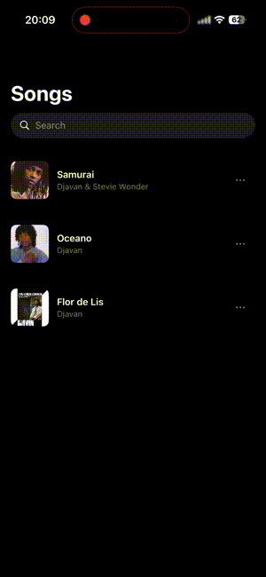
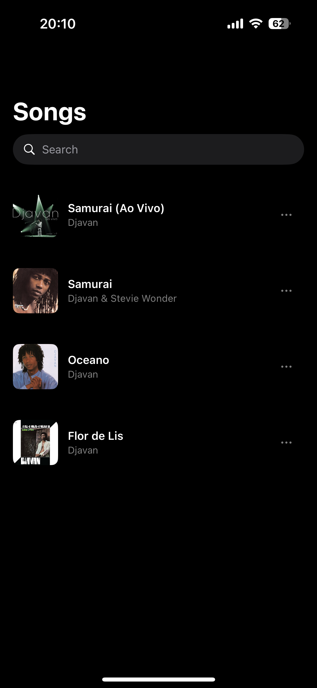
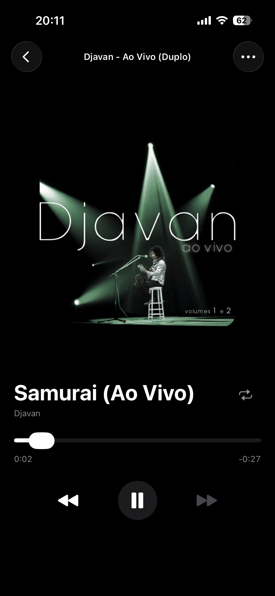
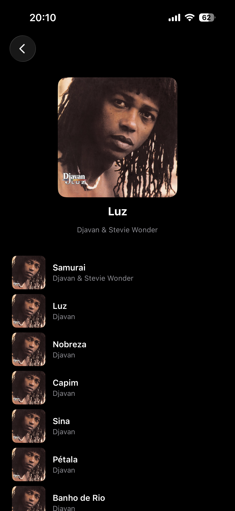
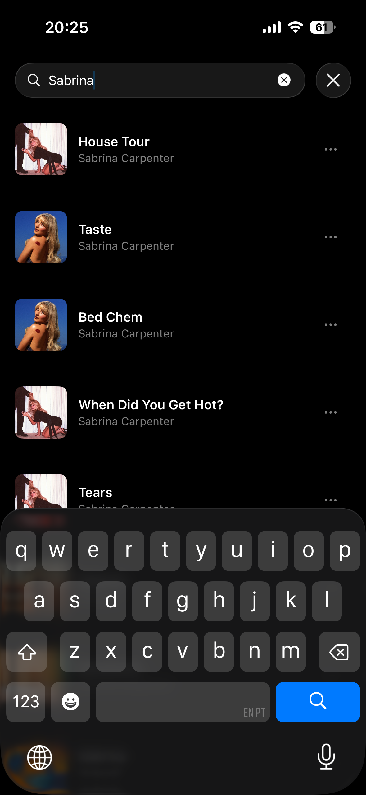
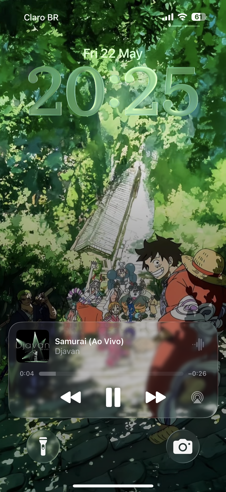
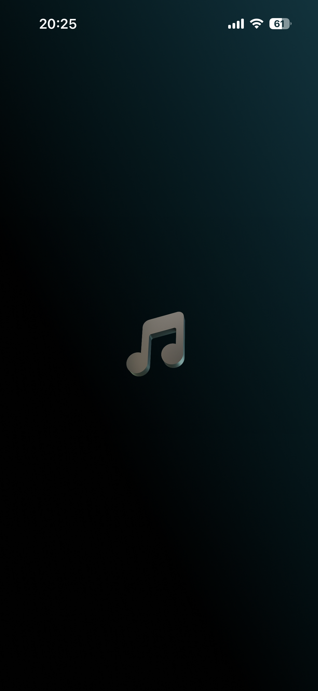

# Music App

An iOS music app that searches and plays songs via the Apple iTunes API, with offline-first design, audio playback with queue management, and persistent cache using SwiftData.

Built with **Swift 6**, **SwiftUI**, **MVVM**, and **Swift Concurrency**.

<p align="center">
  
</p>

## Features

- **Search** — Real-time search with 300ms debounce, infinite scroll pagination
- **Audio Player** — AVQueuePlayer with play/pause/next/previous, queue management, and auto-advance
- **Lock Screen Controls** — Now Playing info with artwork, MPRemoteCommandCenter integration
- **Recently Played** — Persisted play history via SwiftData, shown on launch
- **Album View** — Full tracklist via iTunes lookup API, cache-first for offline access
- **Offline-First** — Recently played, visited albums, and artwork available without network
- **Skeleton Loading** — Shimmer placeholders instead of generic spinners
- **Haptic Feedback** — Tactile response on player controls and song selection

## Screenshots

| Songs | Player | Album |
|-------|--------|-------|
|  |  |  |

| Search | Lock Screen | Splash |
|--------|-------------|--------|
|  |  |  |

## Architecture

```
View (SwiftUI)
  ↓ observes
ViewModel (@MainActor @Observable)
  ↓ calls via MusicRepositoryProtocol
Repository (orchestrates service + cache)
  ↓ via MusicServiceProtocol           ↓ via ModelActor
ITunesService                          MusicModelActor (SwiftData)
  ↓ via NetworkClientProtocol
NetworkClient (generic: request → validate → decode)
  ↓ via HTTPTransport
URLSession
```

Every boundary is a protocol — fully swappable for testing. ViewModels never know about URLSession or SwiftData. The Repository is the single decision point for cache vs. network.

### Project Structure

```
MusicAICodingChallenge/
├── AudioPlayer/            # AVQueuePlayer wrapper, PlayQueue, Now Playing
├── Cache/                  # SwiftData (MusicModelActor, CachedSong), ImageCache
├── DesignSystem/           # Spacing, radius, size tokens
├── Domain/                 # Models (MusicItem, DTOs, errors) + protocols
├── Navigation/             # Route enum + Navigator
├── Networking/             # Generic HTTP layer (Endpoint, NetworkClient, HTTPTransport)
├── Repositories/           # MusicRepository (cache-first orchestration)
├── Services/               # ITunesService + endpoint definitions + internal DTOs
└── Views/
    ├── Album/              # AlbumView + AlbumViewModel
    ├── Common/             # EmptyStateView, CachedAsyncImage, Skeleton, MoreOptionsSheet
    ├── Player/             # PlayerView, PlayerViewModel, MiniPlayerView
    └── Songs/              # SongsView, SongsViewModel, SongRow
```

### Key Design Decisions

- **Search is stateless** — No caching of search results. Online = works, offline = honest empty state. No TTL, no stale fallback.
- **Single cache model** — `CachedSong` serves as both catalog (songs seen) and history (songs played). `playedAt` + `playCount` replace separate tables.
- **Album is cache-first** — Tracklists rarely change. First visit hits the API and caches; subsequent visits are instant and work offline.
- **PlayQueue is a value type** — A plain struct with `advance()`/`regress()`. Testable in isolation without AVFoundation.
- **Image caching** — Custom `CachedAsyncImage` backed by a dedicated `URLCache` (200MB disk). Artworks persist across launches and work offline.
- **Protocol-based DI** — Manual injection via init at the composition root. No DI framework, no service locator.

## Testing

Every layer is tested by substituting the layer below via its protocol:

| Layer Under Test | Replaces | With |
|---|---|---|
| `NetworkClient` | `HTTPTransport` | `StubHTTPTransport` |
| `ITunesService` | `NetworkClient` | `StubHTTPTransport` |
| `MusicRepository` | `MusicServiceProtocol` | `MockMusicService` |
| `SongsViewModel` | `MusicRepositoryProtocol` | `MockMusicRepository` |

Tests use Swift Testing framework and run in parallel — no `URLProtocol`, no static state, no `@Suite(.serialized)`.

## Requirements

- Xcode 26.2+
- iOS 26.2+
- No external dependencies

## Getting Started

1. Clone the repository
2. Open `MusicAICodingChallenge.xcodeproj` in Xcode
3. If running on a physical device, update the signing team in **Signing & Capabilities**
4. Select a simulator or device and run (Cmd+R)

### Release Build (recommended for testing)

For the best performance experience (optimized code, no debugger overhead):

1. **Product → Scheme → Edit Scheme**
2. Under **Run**, change **Build Configuration** to `Release`
3. Uncheck **Debug Executable**
4. Run on device (Cmd+R)

> Remember to switch back to Debug for development.

## iTunes API

The app uses the public [iTunes Search API](https://developer.apple.com/library/archive/documentation/AudioVideo/Conceptual/iTuneSearchAPI/) (no authentication required):

- **Search**: `GET https://itunes.apple.com/search?term=...&media=music&entity=song`
- **Album lookup**: `GET https://itunes.apple.com/lookup?id={collectionId}&entity=song`
- Audio previews are ~30 second M4A clips streamed via `AVQueuePlayer`
